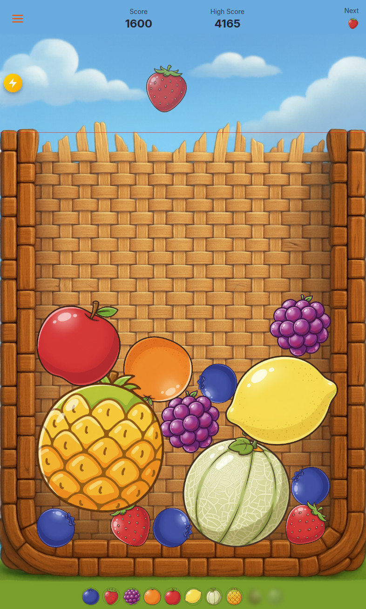

# Fruit Merge Game

A physics-based puzzle game where you drop and merge fruits to create larger fruits and score points!

## 🎮 [PLAY NOW](https://miklbg.github.io/merge_game/) 🎮

## How to Play

1. Click **Start** to begin playing
2. Drag to position the fruit
3. Click or tap to drop the fruit into the container
4. Merge two identical fruits to create the next level fruit
5. Score points with each merge - larger fruits give more points!
6. Game over when fruits stack above the red line

## Features

- **10 Fruit Levels**: Progress from blueberry to watermelon
- **Physics-Based Gameplay**: Realistic fruit physics powered by Matter.js
- **Responsive Design**: Works on desktop and mobile devices
- **Score Tracking**: High score persistence with localStorage
- **Visual Effects**: Confetti animations and warning alerts
- **Audio**: Sound effects and background music
- **Progressive Web App**: Installable with offline support

## License

MIT License - See LICENSE file for details.
